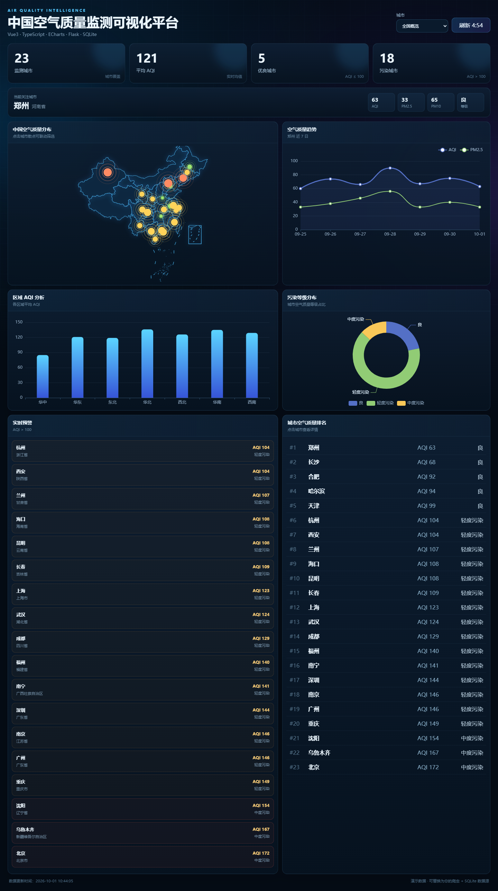

# 中国空气质量监测可视化平台

前后端分离的空气质量数据看板。23 个城市、7 项指标（AQI / PM2.5 / PM10 / SO₂ / NO₂ / CO / O₃）、
近 7 日趋势，覆盖「看数 → 筛选 → 定位」完整链路。

**在线演示**：https://air-quality-dashboard-dimple667.netlify.app/　|　
**源码**：https://github.com/Dimple667/air-quality-dashboard-pro



## 技术栈

| 层 | 技术 |
| --- | --- |
| 前端 | Vue 3 · TypeScript · Vite · Pinia · ECharts · Axios |
| 后端 | Flask · SQLite |
| 部署 | Netlify（构建期 Python 预计算 + Node Function） |

前端 TS/Vue 源码约 650 行，9 个业务组件、4 类 ECharts 图表。

## 功能

- **数据总览** —— 监测城市数、平均 AQI、优良 / 污染城市数
- **地图分布** —— 中国地图散点，点大小映射 AQI，颜色按等级分级
- **多视图联动** —— 地图、排行榜、下拉框三处入口共享同一份选中态
- **趋势分析** —— 选中城市近 7 日 AQI / PM2.5 双折线
- **区域与等级分析** —— 各区域平均 AQI 柱状图、污染等级占比环形图
- **实时预警** —— AQI > 100 的城市列表
- **自动刷新** —— 5 分钟倒计时轮询

## 架构

### 本地开发

```
浏览器 ──/api/*──> Vite dev server ──proxy──> Flask :5000 ──> SQLite
```

### 线上（Netlify）

Netlify Functions 只支持 JavaScript / TypeScript / Go，**没有 Python 运行时**，
所以后端在线上被拆成两段：

```
构建阶段（Python 可用）
  scripts/export_snapshot.py
    · 按固定种子重新生成演示数据，日期窗口锚定构建当天
    · 跑完聚合逻辑
    └─> netlify/data/snapshot.mjs

运行阶段（Netlify Function, JS）
  GET /api/health
  GET /api/cities
  GET /api/dashboard_data?city=北京      ← netlify.toml 从 /api/* 重写而来
```

关键在于函数返回的响应结构与 Flask **完全一致**，因此前端代码零改动 ——
`api/http.ts` 里的 `baseURL: '/api'` 在开发与生产下同时成立。

## 技术亮点

**1. `useECharts` 统一图表生命周期**
把 ECharts 实例的 init / setOption / dispose 与 resize 监听收进一个组合式函数，
4 个图表组件复用。解决的是「每个图表各写一遍生命周期、卸载时忘记 dispose 导致实例泄漏」
这类重复代码问题。见 `frontend/src/composables/useECharts.ts`。

**2. 三处入口的选中态统一收敛到 Pinia**
地图点击、排行榜点击、下拉框切换是三个独立交互入口，如果各自维护状态很容易不一致。
现在三者都只 emit `select-city`，由 store 作为唯一数据源驱动刷新。见 `frontend/src/stores/air.ts`。

**3. 第三方地图数据的降级方案**
中国地图 GeoJSON 运行时从阿里云 DataV 在线加载，加载失败时自动降级为散点视图并给出提示，
而不是让整个面板白屏。见 `frontend/src/components/ChinaMap.vue`。

**4. 前后端统一契约**
后端所有接口返回 `{ code, message, data }`，并注册了全局异常处理，异常时只返回
「服务器内部错误」而不把 Python traceback 暴露给前端。前端 Axios 二次封装对业务码、
超时、连接失败、404 / 500 分别给出不同提示。

## 快速开始

### 后端

```bash
cd backend
python -m venv .venv
.venv\Scripts\activate                 # Windows；macOS/Linux: source .venv/bin/activate
pip install -r requirements.txt
python app.py
```

启动在 `http://127.0.0.1:5000`。首次启动会自动建库并灌入演示数据。

| 接口 | 说明 |
| --- | --- |
| `GET /api/health` | 健康检查 |
| `GET /api/cities` | 城市列表 |
| `GET /api/dashboard_data?city=北京` | 看板核心数据 |

统一响应结构：

```json
{ "code": 0, "message": "success", "data": { ... } }
```

异常时：

```json
{ "code": 500, "message": "服务器内部错误", "data": null }
```

### 前端

```bash
cd frontend
npm install
npm run dev
```

打开 `http://localhost:5173`。前端经 Vite proxy 把 `/api` 转发到 Flask，无需额外配置。

### 构建

```bash
cd frontend && npm run build     # 产物在 frontend/dist/
```

## 部署到 Netlify

仓库根目录的 `netlify.toml` 已配好全部构建设置，在 Netlify 上
**Import 本仓库后无需手填任何构建参数**：

| 项 | 值 |
| --- | --- |
| Build command | `npm --prefix frontend ci && npm --prefix frontend run build && python3 scripts/export_snapshot.py` |
| Publish directory | `frontend/dist` |
| Functions directory | `netlify/functions` |
| 重写规则 | `/api/*` → `/.netlify/functions/api/:splat` |

本地预览线上形态：

```bash
# 生成函数需要的快照（脚本只依赖标准库）
backend/.venv/Scripts/python.exe scripts/export_snapshot.py   # Windows
python3 scripts/export_snapshot.py                            # macOS / Linux

npx netlify-cli dev
```

> `netlify/data/` 是构建产物，已被 `.gitignore` 忽略，所以本地跑 `netlify dev` 前
> 必须先执行导出脚本。Netlify 构建机上 `python3` 直接可用（`netlify.toml` 已声明 `PYTHON_VERSION`）。

## 目录结构

```
air-quality-dashboard-pro/
├── backend/
│   ├── app.py                # Flask 服务（HTTP 层：统一响应、全局异常处理）
│   ├── air_quality_core.py   # 纯业务逻辑：建库、数据生成、聚合查询（不依赖 Flask）
│   ├── air_quality.db        # SQLite 演示数据库
│   └── requirements.txt
├── netlify/
│   ├── functions/api.mjs     # 线上版 /api/* 接口（Netlify Function）
│   └── data/                 # 构建期生成的快照（已 gitignore）
├── scripts/
│   └── export_snapshot.py    # 构建期把数据导出为函数可 import 的 JS 模块
├── docs/dashboard.png        # README 预览图
├── netlify.toml              # Netlify 构建设置与 /api/* 重写规则
└── frontend/
    ├── src/
    │   ├── api/              # Axios 统一封装（baseURL: /api + 请求/响应拦截器）
    │   ├── components/       # 9 个业务组件（图表与 UI）
    │   ├── composables/      # useECharts 组合式函数
    │   ├── stores/           # Pinia（选中城市 / 核心数据 / loading / error）
    │   ├── types/            # TypeScript 类型定义
    │   └── views/            # Dashboard 页面
    ├── index.html
    ├── package.json
    ├── tsconfig.json
    └── vite.config.ts        # dev server proxy: /api -> http://127.0.0.1:5000
```

`air_quality_core.py` 是业务逻辑的唯一来源：本地 Flask 服务与 Netlify 构建脚本都复用它，
两边的数据口径不会跑偏。

## 说明

- `backend/air_quality.db` 仅含演示数据（城市 AQI 模拟值），无敏感信息。
  它是**本地开发**的数据源；线上数据由构建脚本按固定种子重新生成，
  因此趋势图始终是「最近 14 天」，不会随仓库里那份数据一起变旧。
- 数据源替换：把 `backend/air_quality_core.py` 中 `generate_rows()` 的演示数据逻辑
  换成自己的爬虫写入逻辑即可，Flask 与 Netlify 两侧同时生效。
- 中国地图 GeoJSON 依赖阿里云 DataV 的公开接口，加载失败会自动降级为散点视图。
